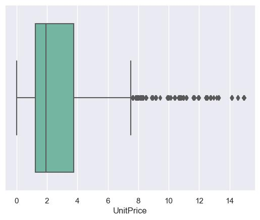
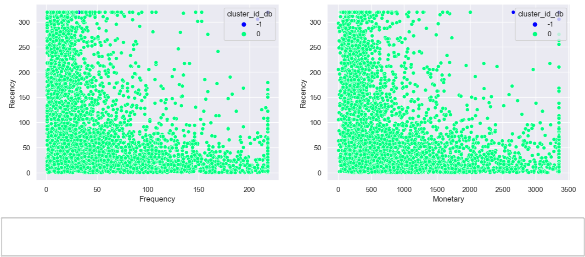

<h1 style="color:blue; text-align:center;"> Customer segmentation </h1>

                                            
<h2 style="color:Red;">Problem Statement:</h2> 

Customer Segmentation is the subdivision of a market into discrete customer groups that share similar characteristics. Customer Segmentation can be a powerful means to identify unsatisfied customer needs. Using the above data, companies can then outperform the competition by developing uniquely appealing products and services. The most common ways in which businesses segment their customer base are:

1.  **Demographic information** includes gender, age, familial and marital status, income, education, and occupation.
1.  **Geographical information** which differs depending on the scope of the company. For localized businesses, this info might pertain to specific towns or counties. On the other hand, it might mean a customer’s city, state, or even country of residence for larger companies.
1.  **Psychographics**, such as social class, lifestyle, and personality traits.
1.  **Behavioural data**, such as spending and consumption habits, product/service usage, and desired benefits.

Advantages of Customer Segmentation

1.  Determine appropriate product pricing.
1.  Develop customized marketing campaigns.
1.  Design an optimal distribution strategy.
1.  Choose specific product features for deployment.
1.  Prioritize new product development efforts. You have to create a project to segment a customer for a banking client based on their transaction history. You have to find out the purchasing capabilities of customers for a different part of the customer.

this application is going to study the behavioural information of the customer based on their past transaction and based on that customer segmentation will be studied.

**Dataset:** [Kaggle Customer Segmentation (https://www.kaggle.com/code/fabiendaniel/customer-segmentation/data)](https://www.kaggle.com/code/fabiendaniel/customer-segmentation/data)

**the ML pipeline**

1.  Data Preprocessing(EDA) 
    1.1 Data Wrangling
    1.2 Data Analysis

2.  Model Building
3.  Model Deployment

*\#importing libraries*

**import** pandas **as** pd

**import** numpy **as** np

**import** nums_from_string

**import** re

**import** datetime

**import** calendar

**from** sklearn **import** metrics

**from** wordcloud **import** WordCloud, STOPWORDS, ImageColorGenerator

**import** matplotlib.pyplot **as** plt

**import** seaborn **as** sns

**%**matplotlib inline

sns.set_style('darkgrid')

sns.set_palette('Set2')

sns.set_context("notebook",font_scale**=**1)

*\# library for warning ignorance*

**import** warnings

warnings.filterwarnings('ignore')

*\# start of the execution time*
**import** time

start_time **=** time.time()

*\# reading the dataset*

cust_df**=**pd.read_csv('data.csv',encoding**=** 'unicode_escape')

cust_df

|            | **InvoiceNo** | **StockCode** | **Description**                     | **Quantity** | **InvoiceDate** | **UnitPrice** | **CustomerID** | **Country**    |
|------------|---------------|---------------|-------------------------------------|--------------|-----------------|---------------|----------------|----------------|
|            |               |               |                                     |              |                 |               |                |                |
| **0**      | 536365        | 85123A        | WHITE HANGING HEART T-LIGHT HOLDER  | 6            | 12/1/2010 8:26  | 2.55          | 17850.0        | United Kingdom |
| **1**      | 536365        | 71053         | WHITE METAL LANTERN                 | 6            | 12/1/2010 8:26  | 3.39          | 17850.0        | United Kingdom |
| **2**      | 536365        | 84406B        | CREAM CUPID HEARTS COAT HANGER      | 8            | 12/1/2010 8:26  | 2.75          | 17850.0        | United Kingdom |
| **3**      | 536365        | 84029G        | KNITTED UNION FLAG HOT WATER BOTTLE | 6            | 12/1/2010 8:26  | 3.39          | 17850.0        | United Kingdom |
| **4**      | 536365        | 84029E        | RED WOOLLY HOTTIE WHITE HEART.      | 6            | 12/1/2010 8:26  | 3.39          | 17850.0        | United Kingdom |
| **...**    | ...           | ...           | ...                                 | ...          | ...             | ...           | ...            | ...            |
| **541904** | 581587        | 22613         | PACK OF 20 SPACEBOY NAPKINS         | 12           | 12/9/2011 12:50 | 0.85          | 12680.0        | France         |
| **541905** | 581587        | 22899         | CHILDREN'S APRON DOLLY GIRL         | 6            | 12/9/2011 12:50 | 2.10          | 12680.0        | France         |
| **541906** | 581587        | 23254         | CHILDRENS CUTLERY DOLLY GIRL        | 4            | 12/9/2011 12:50 | 4.15          | 12680.0        | France         |
| **541907** | 581587        | 23255         | CHILDRENS CUTLERY CIRCUS PARADE     | 4            | 12/9/2011 12:50 | 4.15          | 12680.0        | France         |
| **541908** | 581587        | 22138         | BAKING SET 9 PIECE RETROSPOT        | 3            | 12/9/2011 12:50 | 4.95          | 12680.0        | France         |

541909 rows × 8 columns

**1. Data preprocessing(EDA)**

 *\# checking the shape*

cust_df.shape

Output: (541909, 8)

*\# checking the dataframe information*

cust_df.info()

\<class 'pandas.core.frame.DataFrame'\>

RangeIndex: 541909 entries, 0 to 541908

| Data | columns (total 8 columns): |                |          |         |
|------|----------------------------|----------------|----------|---------|
| \#   | Column                     | Non-Null Count | Dtype    |         |
| ---  | ------                     | -------------- | -----    |         |
| 0    | InvoiceNo                  | 541909         | non-null | object  |
| 1    | StockCode                  | 541909         | non-null | object  |
| 2    | Description                | 540455         | non-null | object  |
| 3    | Quantity                   | 541909         | non-null | int64   |
| 4    | InvoiceDate                | 541909         | non-null | object  |
| 5    | UnitPrice                  | 541909         | non-null | float64 |
| 6    | CustomerID                 | 406829         | non-null | float64 |
| 7    | Country                    | 541909         | non-null | object  |

dtypes: float64(2), int64(1), object(5)

memory usage: 33.1+ MB

**Data description:**

This dataframe contains 8 variables that correspond to:

1.  **InvoiceNo:** Invoice number. Nominal, a 6-digit integral number uniquely assigned to each transaction. If this code starts with letter 'c', it indicates a cancellation.
1.  **StockCode:** Product (item) code. Nominal, a 5-digit integral number uniquely assigned to each distinct product.
1.  **Description:** Product (item) name. Nominal.
1.  **Quantity:** The quantities of each product (item) per transaction. Numeric.
1.  **InvoiceDate:** Invice Date and time. Numeric, the day and time when each transaction was generated.
1.  **UnitPrice:** Unit price. Numeric, Product price per unit in sterling.
1.  **CustomerID:** Customer number. Nominal, a 5-digit integral number uniquely assigned to each customer.
1.  **Country:** Country name. Nominal, the name of the country where each customer resides.

**1.1 Data Wrangaling**

*\# shape of the dataframe*

print('Dataframe dimensions:', cust_df.shape)

*\#___________________________________________________________\_*

*\# gives some infos on columns types and numer of null values*

df_info**=**pd.DataFrame(cust_df.dtypes).T.rename(index**=**{0:'column type'})

df_info**=**df_info.append(pd.DataFrame(cust_df.isnull().sum()).T.rename(index**=**{0:'null values (nb)'}))

df_info**=**df_info.append(pd.DataFrame(cust_df.isnull().sum()**/**cust_df.shape[0]**\***100).T.

rename(index**=**{0:'null values (%)'}))

df_info

Dataframe dimensions: (541909, 8)

|                      | **InvoiceNo** | **StockCode** | **Description** | **Quantity** | **InvoiceDate** | **UnitPrice** | **CustomerID** | **Country** |
|----------------------|---------------|---------------|-----------------|--------------|-----------------|---------------|----------------|-------------|
|                      |               |               |                 |              |                 |               |                |             |
| **column type**      | object        | object        | object          | int64        | object          | float64       | float64        | object      |
| **null values (nb)** | 0             | 0             | 1454            | 0            | 0               | 0             | 135080         | 0           |
| **null values (%)**  | 0.0           | 0.0           | 0.268311        | 0.0          | 0.0             | 0.0           | 24.926694      | 0.0         |

**1.1.1 handling null values**

In [6]: ((cust_df.isnull().sum()**/**len(cust_df))**\***100).sort_values(ascending**=False**)

| Out[6]: CustomerID | 24.926694 |
|--------------------|-----------|
| Description        | 0.268311  |
| InvoiceNo          | 0.000000  |
| StockCode          | 0.000000  |
| Quantity           | 0.000000  |
| InvoiceDate        | 0.000000  |
| UnitPrice          | 0.000000  |
| Country            | 0.000000  |
| dtype: float64     |           |

customer id is identification number for each customer so it is not a continous variable, it should be converted into object type

In [7]: cust_df**=**cust_df[**\~**cust_df.CustomerID.isnull()]

((cust_df.isnull().sum()**/**len(cust_df))**\***100).sort_values(ascending**=False**)

| Out[7]: InvoiceNo | 0.0 |
|-------------------|-----|
| StockCode         | 0.0 |
| Description       | 0.0 |
| Quantity          | 0.0 |
| InvoiceDate       | 0.0 |
| UnitPrice         | 0.0 |
| CustomerID        | 0.0 |
| Country           | 0.0 |
| dtype: float64    |     |

In [8]: cust_df.shape

Out[8]: (406829, 8)

**Null values are handled successfully**

**1.1.2. Inspecting data type of columns**

In [9]: cust_df.CustomerID**=**cust_df.CustomerID.astype('object')

cust_df.info()

\<class 'pandas.core.frame.DataFrame'\>

Int64Index: 406829 entries, 0 to 541908

| Data | columns (total 8 columns): |                |          |         |
|------|----------------------------|----------------|----------|---------|
| \#   | Column                     | Non-Null Count | Dtype    |         |
| ---  | ------                     | -------------- | -----    |         |
| 0    | InvoiceNo                  | 406829         | non-null | object  |
| 1    | StockCode                  | 406829         | non-null | object  |
| 2    | Description                | 406829         | non-null | object  |
| 3    | Quantity                   | 406829         | non-null | int64   |
| 4    | InvoiceDate                | 406829         | non-null | object  |
| 5    | UnitPrice                  | 406829         | non-null | float64 |
| 6    | CustomerID                 | 406829         | non-null | object  |
| 7    | Country                    | 406829         | non-null | object  |

dtypes: float64(1), int64(1), object(6)

memory usage: 27.9+ MB

In [10]: cust_df.head(5)

| Out[10]: | **InvoiceNo** | **StockCode** | **Description**                     | **Quantity** | **InvoiceDate** | **UnitPrice** | **CustomerID** | **Country**    |   |
|----------|---------------|---------------|-------------------------------------|--------------|-----------------|---------------|----------------|----------------|---|
|          |               |               |                                     |              |                 |               |                |                |   |
| **0**    | 536365        | 85123A        | WHITE HANGING HEART T-LIGHT HOLDER  | 6            | 12/1/2010 8:26  | 2.55          | 17850.0        | United Kingdom |   |
| **1**    | 536365        | 71053         | WHITE METAL LANTERN                 | 6            | 12/1/2010 8:26  | 3.39          | 17850.0        | United Kingdom |   |
| **2**    | 536365        | 84406B        | CREAM CUPID HEARTS COAT HANGER      | 8            | 12/1/2010 8:26  | 2.75          | 17850.0        | United Kingdom |   |
| **3**    | 536365        | 84029G        | KNITTED UNION FLAG HOT WATER BOTTLE | 6            | 12/1/2010 8:26  | 3.39          | 17850.0        | United Kingdom |   |
| **4**    | 536365        | 84029E        | RED WOOLLY HOTTIE WHITE HEART.      | 6            | 12/1/2010 8:26  | 3.39          | 17850.0        | United Kingdom |   |

-   *converting CustomerID to object type because it is a categorical column* cust_df['CustomerID']**=**cust_df.CustomerID.apply(**lambda** x: str(x).split('.')[0])
-   *rechecking the dataframe*

cust_df.head(5)

|       | **InvoiceNo** | **StockCode** | **Description**                     | **Quantity** | **InvoiceDate** | **UnitPrice** | **CustomerID** | **Country**    |
|-------|---------------|---------------|-------------------------------------|--------------|-----------------|---------------|----------------|----------------|
|       |               |               |                                     |              |                 |               |                |                |
| **0** | 536365        | 85123A        | WHITE HANGING HEART T-LIGHT HOLDER  | 6            | 12/1/2010 8:26  | 2.55          | 17850          | United Kingdom |
| **1** | 536365        | 71053         | WHITE METAL LANTERN                 | 6            | 12/1/2010 8:26  | 3.39          | 17850          | United Kingdom |
| **2** | 536365        | 84406B        | CREAM CUPID HEARTS COAT HANGER      | 8            | 12/1/2010 8:26  | 2.75          | 17850          | United Kingdom |
| **3** | 536365        | 84029G        | KNITTED UNION FLAG HOT WATER BOTTLE | 6            | 12/1/2010 8:26  | 3.39          | 17850          | United Kingdom |
| **4** | 536365        | 84029E        | RED WOOLLY HOTTIE WHITE HEART.      | 6            | 12/1/2010 8:26  | 3.39          | 17850          | United Kingdom |

In [13]: cust_df["Invoicedt"] **=** pd.to_datetime(cust_df["InvoiceDate"])

​

cust_df['InvoiceYear']**=**pd.DatetimeIndex(cust_df['Invoicedt']).year

​

cust_df['InvoiceMonth']**=**cust_df['Invoicedt'].dt.month

​

cust_df['Month'] **=** cust_df['InvoiceMonth'].apply(**lambda** x: calendar.month_abbr[x])

​

cust_df.drop(columns**=**'InvoiceMonth',inplace**=True**,axis**=**1)

In [14]: cust_df.InvoiceNo.value_counts()

| Out[14]: 576339 | 542 |
|-----------------|-----|
| 579196          | 533 |
| 580727          | 529 |
| 578270          | 442 |
| 573576          | 435 |
|                 | ... |
| 554155          | 1   |
| 570248          | 1   |
| 545414          | 1   |
| 545418          | 1   |
| 565192          | 1   |

Name: InvoiceNo, Length: 22190, dtype: int64

invoice number holds the information about the order placed by the customer. it holds only the unique id of the transaction, so this is not much significant but this feature also holds the information about the cancelled order, so segregating the canceled order from the original dataframe will help to create segment of the canceled order.

-   *creating new feature canceled flag for true value for canceled order* cust_df['canceled'] **=** cust_df['InvoiceNo'].apply(**lambda** x:int('C' **in** x))

*\#cust_df.shape*

​

cust_df.head()

​

-   *seperating the canceled order from the original dataframe and creating new canceled dataframe* canceled_cust_df**=**cust_df[cust_df.canceled**==**1] canceled_cust_df.reset_index(inplace**=True**,drop**=True**)

canceled_cust_df.head()

​

-   *removing the canceled order transaction from the original dataframe*

cust_df**=**cust_df[cust_df.canceled**==**0]

cust_df.drop('canceled',axis**=**1,inplace**=True**)

cust_df.shape

​

cust_df.head()

|       | **InvoiceNo** | **StockCode** | **Description**             | **Quantity** | **InvoiceDate UnitPrice** | **CustomerID** | **Country** | **Invoicedt InvoiceYear** | **Month**  |      |     |
|-------|---------------|---------------|-----------------------------|--------------|---------------------------|----------------|-------------|---------------------------|------------|------|-----|
|       |               |               |                             |              |                           |                |             |                           |            |      |     |
| **0** | 536365        | 85123A        | WHITE HANGING HEART T-LIGHT | 6            | 12/1/2010                 | 2.55           | 17850       | United                    | 2010-12-01 | 2010 | Dec |
|       |               |               | HOLDER                      |              | 8:26                      |                |             | Kingdom                   | 08:26:00   |      |     |
|       |               |               |                             |              |                           |                |             |                           |            |      |     |
| **1** | 536365        | 71053         | WHITE METAL LANTERN         | 6            | 12/1/2010                 | 3.39           | 17850       | United                    | 2010-12-01 | 2010 | Dec |
|       |               |               |                             |              | 8:26                      |                |             | Kingdom                   | 08:26:00   |      |     |
|       |               |               |                             |              |                           |                |             |                           |            |      |     |
| **2** | 536365        | 84406B        | CREAM CUPID HEARTS COAT     | 8            | 12/1/2010                 | 2.75           | 17850       | United                    | 2010-12-01 | 2010 | Dec |
|       |               |               | HANGER                      |              | 8:26                      |                |             | Kingdom                   | 08:26:00   |      |     |
|       |               |               |                             |              |                           |                |             |                           |            |      |     |
| **3** | 536365        | 84029G        | KNITTED UNION FLAG HOT      | 6            | 12/1/2010                 | 3.39           | 17850       | United                    | 2010-12-01 | 2010 | Dec |
|       |               |               | WATER BOTTLE                |              | 8:26                      |                |             | Kingdom                   | 08:26:00   |      |     |
|       |               |               |                             |              |                           |                |             |                           |            |      |     |
| **4** | 536365        | 84029E        | RED WOOLLY HOTTIE WHITE     | 6            | 12/1/2010                 | 3.39           | 17850       | United                    | 2010-12-01 | 2010 | Dec |
|       |               |               | HEART.                      |              | 8:26                      |                |             | Kingdom                   | 08:26:00   |      |     |
|       |               |               |                             |              |                           |                |             |                           |            |      |     |

**1.1.3. inspecting outliers**

-   *checking the data distribution of the numerical column* cust_df.describe()

**Quantity** **UnitPrice** **InvoiceYear**

**count** 397924.000000 397924.000000 397924.000000

| **mean** | 13.021823    | 3.116174    | 2010.934259 |
|----------|--------------|-------------|-------------|
| **std**  | 180.420210   | 22.096788   | 0.247829    |
| **min**  | 1.000000     | 0.000000    | 2010.000000 |
| **25%**  | 2.000000     | 1.250000    | 2011.000000 |
| **50%**  | 6.000000     | 1.950000    | 2011.000000 |
| **75%**  | 12.000000    | 3.750000    | 2011.000000 |
| **max**  | 80995.000000 | 8142.750000 | 2011.000000 |

In [17]: *\# plotting the data distribution of the Quantity feature*

plt.boxplot(cust_df.Quantity)

plt.show()

an outlier is an extreme data point which has huge difference from other observation. and it will be very difficult to analyse the data for meaningful insight with the outlier. above boxplot shows the outlier of the Quantity feature and it is very difficult to get any insight from it. so for outlier handling there are two ways either to remove them or cap them within the limit.

In [18]: *\# checking data distribution for multiple percentile*

cust_df.Quantity.quantile([0,0.01,0.02,0.03,0.04,0.9,0.95,0.99,1])

| Out[18]: 0.00 | 1.0     |
|---------------|---------|
| 0.01          | 1.0     |
| 0.02          | 1.0     |
| 0.03          | 1.0     |
| 0.04          | 1.0     |
| 0.90          | 24.0    |
| 0.95          | 36.0    |
| 0.99          | 120.0   |
| 1.00          | 80995.0 |

Name: Quantity, dtype: float64

In [19]: cust_df[cust_df.Quantity**\>**120].Quantity.value_counts().sum()

Out[19]: 3896

In [20]: cust_df.shape

Out[20]: (397924, 11)

In [21]: *\# removing the outlier*

cust_df**=**cust_df[cust_df.Quantity**\<=**120]

cust_df.shape

Out[21]: (394028, 11)

In [22]: sns.boxplot(cust_df.Quantity)

plt.show()

Quantity feature still has some outlier but these outlier holding important information about the customer who interested in high quantity value

In [23]: *\# analysing the unitPrice for outlier*

plt.boxplot(cust_df.UnitPrice)

plt.show()

In [24]: cust_df.UnitPrice.quantile([0.9,0.93,0.95,0.99,1])

| Out[24]: 0.90 | 6.45    |
|---------------|---------|
| 0.93          | 7.95    |
| 0.95          | 8.50    |
| 0.99          | 14.95   |
| 1.00          | 8142.75 |

Name: UnitPrice, dtype: float64

99 percentile value is 14.95 and 100 is 8142.75 within one percentile there is huge diffence between the data points hence data points beyond the value 14.95 is outlier and will be removed from the dataframe.

In [25]: *\# checking the number of rows for the outlier count*

cust_df[cust_df.UnitPrice**\>**14.95].shape

Out[25]: (3734, 11)

In [26]: *\# removing the outlier from UnitPrice*

cust_df**=**cust_df[cust_df.UnitPrice**\<=**14.95]

cust_df.shape

Out[26]: (390294, 11)

In [27]: *\# replotting the boxplot for UnitPrice*

sns.boxplot(cust_df.UnitPrice)

plt.show()

UnitPrice still has some outliers but theses data points for the customer which helps in improving the business

**new feature creation**

the target of this application is to segment the customer based on their purchasing behaviour. since the dataframe has two feature based on that customer purchasing behaviour can be analysed i.e. Quantity and Unitprice. using these two feature a new feature order_value will be created which helps in studying the trasaction value of each customer based on that segmentation will be performed.

| In [28]: | *\# creating new feature* |                                                                         |                     |              |                           |                |             |                           |            |                |     |       |   |
|----------|---------------------------|-------------------------------------------------------------------------|---------------------|--------------|---------------------------|----------------|-------------|---------------------------|------------|----------------|-----|-------|---|
|          |                           | cust_df['OrderValue']**=**cust_df['Quantity']**\***cust_df['UnitPrice'] |                     |              |                           |                |             |                           |            |                |     |       |   |
|          |                           | cust_df.head()                                                          |                     |              |                           |                |             |                           |            |                |     |       |   |
| Out[28]: | **InvoiceNo**             | **StockCode**                                                           | **Description**     | **Quantity** | **InvoiceDate UnitPrice** | **CustomerID** | **Country** | **Invoicedt InvoiceYear** | **Month**  | **OrderValue** |     |       |   |
|          |                           |                                                                         |                     |              |                           |                |             |                           |            |                |     |       |   |
| **0**    | 536365                    | 85123A                                                                  | WHITE HANGING HEART | 6            | 12/1/2010                 | 2.55           | 17850       | United                    | 2010-12-01 | 2010           | Dec | 15.30 |   |
|          |                           |                                                                         | T-LIGHT HOLDER      |              | 8:26                      |                |             | Kingdom                   | 08:26:00   |                |     |       |   |
|          |                           |                                                                         |                     |              |                           |                |             |                           |            |                |     |       |   |
| **1**    | 536365                    | 71053                                                                   | WHITE METAL LANTERN | 6            | 12/1/2010                 | 3.39           | 17850       | United                    | 2010-12-01 | 2010           | Dec | 20.34 |   |
|          |                           |                                                                         |                     |              | 8:26                      |                |             | Kingdom                   | 08:26:00   |                |     |       |   |
|          |                           |                                                                         |                     |              |                           |                |             |                           |            |                |     |       |   |
| **2**    | 536365                    | 84406B                                                                  | CREAM CUPID HEARTS  | 8            | 12/1/2010                 | 2.75           | 17850       | United                    | 2010-12-01 | 2010           | Dec | 22.00 |   |
|          |                           |                                                                         | COAT HANGER         |              | 8:26                      |                |             | Kingdom                   | 08:26:00   |                |     |       |   |
|          |                           |                                                                         |                     |              |                           |                |             |                           |            |                |     |       |   |
| **3**    | 536365                    | 84029G                                                                  | KNITTED UNION FLAG  | 6            | 12/1/2010                 | 3.39           | 17850       | United                    | 2010-12-01 | 2010           | Dec | 20.34 |   |
|          |                           |                                                                         | HOT WATER BOTTLE    |              | 8:26                      |                |             | Kingdom                   | 08:26:00   |                |     |       |   |
|          |                           |                                                                         |                     |              |                           |                |             |                           |            |                |     |       |   |
| **4**    | 536365                    | 84029E                                                                  | RED WOOLLY HOTTIE   | 6            | 12/1/2010                 | 3.39           | 17850       | United                    | 2010-12-01 | 2010           | Dec | 20.34 |   |
|          |                           |                                                                         | WHITE HEART.        |              | 8:26                      |                |             | Kingdom                   | 08:26:00   |                |     |       |   |
|          |                           |                                                                         |                     |              |                           |                |             |                           |            |                |     |       |   |

**1.2 Data Analysis**

**1.2.1 Univariate Analysis**

In [29]: cust_df.info()

\<class 'pandas.core.frame.DataFrame'\>

Int64Index: 390294 entries, 0 to 541908

| Data | columns (total 12 columns): |                |          |                |
|------|-----------------------------|----------------|----------|----------------|
| \#   | Column                      | Non-Null Count | Dtype    |                |
| ---  | ------                      | -------------- | -----    |                |
| 0    | InvoiceNo                   | 390294         | non-null | object         |
| 1    | StockCode                   | 390294         | non-null | object         |
| 2    | Description                 | 390294         | non-null | object         |
| 3    | Quantity                    | 390294         | non-null | int64          |
| 4    | InvoiceDate                 | 390294         | non-null | object         |
| 5    | UnitPrice                   | 390294         | non-null | float64        |
| 6    | CustomerID                  | 390294         | non-null | object         |
| 7    | Country                     | 390294         | non-null | object         |
| 8    | Invoicedt                   | 390294         | non-null | datetime64[ns] |

-   InvoiceYear 390294 non-null int64

| 10                                                                                                                         | Month                                                      | 390294 non-null | object              |                          |               |                |             |                           |            |                |     |       |   |   |
|----------------------------------------------------------------------------------------------------------------------------|------------------------------------------------------------|-----------------|---------------------|--------------------------|---------------|----------------|-------------|---------------------------|------------|----------------|-----|-------|---|---|
| 11                                                                                                                         | OrderValue 390294 non-null                                 | float64         |                     |                          |               |                |             |                           |            |                |     |       |   |   |
|                                                                                                                            | dtypes: datetime64[ns](1), float64(2), int64(2), object(7) |                 |                     |                          |               |                |             |                           |            |                |     |       |   |   |
|                                                                                                                            | memory usage: 38.7+ MB                                     |                 |                     |                          |               |                |             |                           |            |                |     |       |   |   |
| there are only 8 features in the dataframe. so in this section each feature will be analyse based on the problem statement |                                                            |                 |                     |                          |               |                |             |                           |            |                |     |       |   |   |
| In [30]:                                                                                                                   | cust_df.head()                                             |                 |                     |                          |               |                |             |                           |            |                |     |       |   |   |
| Out[30]:                                                                                                                   | **InvoiceNo**                                              | **StockCode**   | **Description**     | **Quantity InvoiceDate** | **UnitPrice** | **CustomerID** | **Country** | **Invoicedt InvoiceYear** | **Month**  | **OrderValue** |     |       |   |   |
|                                                                                                                            |                                                            |                 |                     |                          |               |                |             |                           |            |                |     |       |   |   |
| **0**                                                                                                                      | 536365                                                     | 85123A          | WHITE HANGING HEART | 6                        | 12/1/2010     | 2.55           | 17850       | United                    | 2010-12-01 | 2010           | Dec | 15.30 |   |   |
|                                                                                                                            |                                                            |                 | T-LIGHT HOLDER      |                          | 8:26          |                |             | Kingdom                   | 08:26:00   |                |     |       |   |   |
|                                                                                                                            |                                                            |                 |                     |                          |               |                |             |                           |            |                |     |       |   |   |
| **1**                                                                                                                      | 536365                                                     | 71053           | WHITE METAL LANTERN | 6                        | 12/1/2010     | 3.39           | 17850       | United                    | 2010-12-01 | 2010           | Dec | 20.34 |   |   |
|                                                                                                                            |                                                            |                 |                     |                          | 8:26          |                |             | Kingdom                   | 08:26:00   |                |     |       |   |   |
|                                                                                                                            |                                                            |                 |                     |                          |               |                |             |                           |            |                |     |       |   |   |
| **2**                                                                                                                      | 536365                                                     | 84406B          | CREAM CUPID HEARTS  | 8                        | 12/1/2010     | 2.75           | 17850       | United                    | 2010-12-01 | 2010           | Dec | 22.00 |   |   |
|                                                                                                                            |                                                            |                 | COAT HANGER         |                          | 8:26          |                |             | Kingdom                   | 08:26:00   |                |     |       |   |   |
|                                                                                                                            |                                                            |                 |                     |                          |               |                |             |                           |            |                |     |       |   |   |
| **3**                                                                                                                      | 536365                                                     | 84029G          | KNITTED UNION FLAG  | 6                        | 12/1/2010     | 3.39           | 17850       | United                    | 2010-12-01 | 2010           | Dec | 20.34 |   |   |
|                                                                                                                            |                                                            |                 | HOT WATER BOTTLE    |                          | 8:26          |                |             | Kingdom                   | 08:26:00   |                |     |       |   |   |
|                                                                                                                            |                                                            |                 |                     |                          |               |                |             |                           |            |                |     |       |   |   |
| **4**                                                                                                                      | 536365                                                     | 84029E          | RED WOOLLY HOTTIE   | 6                        | 12/1/2010     | 3.39           | 17850       | United                    | 2010-12-01 | 2010           | Dec | 20.34 |   |   |
|                                                                                                                            |                                                            |                 | WHITE HEART.        |                          | 8:26          |                |             | Kingdom                   | 08:26:00   |                |     |       |   |   |
|                                                                                                                            |                                                            |                 |                     |                          |               |                |             |                           |            |                |     |       |   |   |

**1. StockCode**

In [31]: cust_df.StockCode.value_counts()

| Out[31]: 85123A | 1998 |
|-----------------|------|
| 22423           | 1707 |
| 85099B          | 1560 |
| 47566           | 1385 |
| 84879           | 1355 |
|                 | ...  |
| 20678           | 1    |
| 90059D          | 1    |
| 90169           | 1    |
| 90202A          | 1    |
| 71143           | 1    |

Name: StockCode, Length: 3626, dtype: int64

In [32]: cust_df.StockCode.nunique()

Out[32]: 3626

This feature is to uniquely identifying the item. there are 3626 items available for the customer

**2. Description**

In [33]: *\# plotting a bar graph for top 15 products in demand*

cust_df.Description.value_counts().head(15).plot(kind**=**'barh')

plt.show()

**Insight:** White hanging Heart T-Light holder is the most frequent products demanded by the customer based on the value count.

In [34]: *\# plotting a word cloud for the product feature*

text **=** " ".join(item **for** item **in** cust_df.Description)

stopwords **=** set(STOPWORDS)

wordcloud **=** WordCloud(width **=** 800, height **=** 500,

background_color **=**'white',font_path**=**'arial',

stopwords **=** stopwords,

min_font_size **=** 10).generate(text)

*\# plot the WordCloud image*

plt.figure(figsize **=** (4,4), facecolor **= None**)

plt.imshow(wordcloud)

plt.axis("off")

plt.tight_layout(pad **=** 0)

plt.show()

**Insight**

1.  from the word cloud Bags like jumbo bag, lunch bag, Charlotte bag , bag vintage are most common among customer.
1.  Other popular items are T-light, Light Holder, Metal Sugn, Vintage Christmas, Water bottle, Hot water etc.
1.  **Quantity**

In [35]: *\# Plotting histogram and boxplot for data distribution*

​

​

plt.figure(figsize**=**(15,5))

plt.subplot(1,2,1)

plt.suptitle("Data distribution of the Quantity Feature")

sns.distplot(x**=**cust_df.Quantity,bins**=**20)

plt.subplot(1,2,2)

sns.boxplot(cust_df.Quantity,)

plt.show()

**Insight:**

1.  the distplot shows density of data point is the highest for the 0-5 bin, that means most of the customer intrested in buying quntity in between 0-5 and then 5-10.
2.  and bin 15-20 is little higher than other quantity range.
1.  the boxplot represents 75% customer buying product quantity is almost 15 value.
1.  there are some other customer who bought higher quantity that is beyond 25 value they are considered as exception and treated as outlier in the boxplot.
1.  **InvoiceDate**

In [36]: *\# pie chart for data contribution year wise*

cust_df.InvoiceYear.value_counts(normalize**=True**).plot.pie()

plt.show()

In [37]: *\# Pie chart for month wise data contribution*

cust_df.Month.value_counts(normalize**=True**).plot.pie()

plt.show()

**Insight:**

1.  Most of the order placed in November month.
1.  Frome the sep to december most of the business is coming from the customer it is because of the holiday season.
1.  and after the holiday season Jan to april business is going down.
1.  **UnitPrice**

In [38]: *\# histogram plot and boxplot for data distribution of the unit price* plt.figure(figsize**=**(15,5))

plt.subplot(1,2,1)

sns.distplot(x**=**cust_df.UnitPrice,bins**=**15)

plt.subplot(1,2,2)

sns.boxplot(cust_df.UnitPrice)

plt.show()

**Insight:**

1.  Most of the customer intrested in unit price 1-2 and then 0-1.
1.  the boxplot represents 75% customer interested in unit price less than 4
1.  there are few customer who also interested in high unit price of the products but beyond unit price somewhat around 7.5 are treated as outlier.
1.  **CustomerID**

In [39]: *\# Customer id wise transaction count*

cust_df.CustomerID.value_counts()

| Out[39]: 17841 | 7813 |
|----------------|------|
| 14911          | 5485 |
| 14096          | 4902 |
| 12748          | 4546 |
| 14606          | 2680 |
|                | ...  |
| 13703          | 1    |
| 17925          | 1    |
| 14351          | 1    |
| 17391          | 1    |
| 15940          | 1    |

Name: CustomerID, Length: 4290, dtype: int64

In [40]: *\# number of unique customer*

cust_df.CustomerID.nunique()

Out[40]: 4290

total number of customer base is 4290

In [41]: *\# top 10 customer based on the order count*

plt.figure(figsize**=**(10,5))

cust_df.CustomerID.value_counts().head(10).sort_values(ascending**=True**).plot(kind**=**'barh',title**=**"top 10 the most frequent cust

plt.show()

​

**8. Country**

In [42]: *\# top 10 country*

Figure,axes**=**plt.subplots(2,1,figsize**=**(10,9))

cust_df.Country.value_counts().head(10).sort_values(ascending**=True**).plot(kind**=**'barh',ax**=**axes[0],title**=**"Top 10 countries")

​

cust_df.Country.value_counts().tail(10).sort_values(ascending**=False**).plot(kind**=**'barh',ax**=**axes[1],title**=**"Bottom 10 countries"

​

plt.show()

**Insight:**

1.  Most order is coming from the UK.
1.  other than Uk only 4 countries are contributing in the sales germany, France, EIRE and spain. Other countries also need to be analyse to improve the sales in their region.

In [43]: *\# histogram plot and boxplot for data distribution of the unit price* plt.figure(figsize**=**(15,5))

plt.subplot(1,2,1)

sns.distplot(x**=**cust_df.OrderValue,bins**=**15)

plt.subplot(1,2,2)

sns.boxplot(cust_df.OrderValue)

plt.show()

**1.2.2. Bivariate Analysis**

**1.2.2.1 Product in high demand**

In [44]: *\# plotting bar plot of the products for average high quantity demanded by the customer*

​

cust_df.groupby(['Description'])['Quantity'].mean().sort_values(ascending**=False**).head(10).sort_values(ascending**=True**).plot(k plt.show()

**Insight:**

1\. order for average quantity of the mini highlighter pens is the highest i.e. 120.

**1.2.2.2 Frequently bought product vs highest quantity demanded**

In [45]: *\# creating new dataframe for average quantity demand of the product*

Product_df**=**pd.DataFrame(round(cust_df.groupby(['Description'])['Quantity'].mean(),2))

​

*\# creating new dataframe for average OrderValue demand of the product*

Product_df_order**=**pd.DataFrame(round(cust_df.groupby(['Description'])['OrderValue'].mean(),2))

​

*\# creating new dataframe for average UnitPrice demand of the product*

Product_df_price**=**pd.DataFrame(round(cust_df.groupby(['Description'])['UnitPrice'].mean(),2))

​

*\# creating new dataframe for frequency of the product*

Product_freq**=**pd.DataFrame(cust_df.groupby(['Description'])['Description'].count())

Product_freq.rename(columns**=**{'Description':'Frequency'},inplace**=True**)

​

​

-   *merging the frequency of the product with the average quantity in demand* Product_df**=**pd.merge(Product_df,Product_df_order,how**=**'inner',on**=**'Description') Product_df**=**pd.merge(Product_df,Product_df_price,how**=**'inner',on**=**'Description') Product_df**=**pd.merge(Product_df,Product_freq,how**=**'inner',on**=**'Description')

    ​

Product_df.head()

| Out[45]: | **Quantity**                      | **OrderValue** | **UnitPrice** | **Frequency** |     |
|----------|-----------------------------------|----------------|---------------|---------------|-----|
|          | **Description**                   |                |               |               |     |
|          |                                   |                |               |               |     |
|          | **4 PURPLE FLOCK DINNER CANDLES** | 3.59           | 6.94          | 2.32          | 39  |
|          | **50'S CHRISTMAS GIFT BAG LARGE** | 13.75          | 17.19         | 1.25          | 108 |
|          | **DOLLY GIRL BEAKER**             | 7.50           | 9.38          | 1.25          | 133 |
|          | **I LOVE LONDON MINI BACKPACK**   | 5.14           | 20.77         | 4.14          | 70  |
|          | **I LOVE LONDON MINI RUCKSACK**   | 1.00           | 4.15          | 4.15          | 1   |

In [46]: *\# plotting scatterplot*

Figure,axes**=**plt.subplots(1,3,figsize**=**(15,6))

sns.scatterplot(data**=**Product_df,x**=**'Quantity',y**=**'Frequency',ax**=**axes[0])

sns.scatterplot(data**=**Product_df,x**=**'OrderValue',y**=**'Frequency',ax**=**axes[1])

sns.scatterplot(data**=**Product_df,x**=**'UnitPrice',y**=**'Frequency',ax**=**axes[2])

plt.show()

there are some extreme value in ordervalue and quantity, dropping those values will help in better understanding the relationship

In [47]: *\# dropping extreme value for better visualisation*

​

Product_df**=**Product_df[Product_df.OrderValue**\<**100]

Product_df**=**Product_df[Product_df.Quantity**\<**60]

In [48]: *\# replotting scatterplot*

Figure,axes**=**plt.subplots(1,3,figsize**=**(15,6))

sns.scatterplot(data**=**Product_df,x**=**'Quantity',y**=**'Frequency',ax**=**axes[0])

sns.scatterplot(data**=**Product_df,x**=**'OrderValue',y**=**'Frequency',ax**=**axes[1])

sns.scatterplot(data**=**Product_df,x**=**'UnitPrice',y**=**'Frequency',ax**=**axes[2])

plt.show()

**Insight:**

1.  there is no linear relationship between frequent product and quantity of the product.
1.  thre are many product whose frequency is very high but their quantity value is not much and same there are some product whose many quantity demanded by the customer but they are not much popular.
2.  frequency of the product has same relationship with average quantity demand and ordervalue placed by the customer.
1.  as expected lower the unitprice there is high frequncy of the product.
1.  so this will help in understanding the customer group who buys wholesale item in bulk as per their business requirement.

**1.2.2.3 Country wise average quantity in demand**

In [49]: cust_df.groupby(['Country'])['Quantity'].mean().sort_values(ascending**=False**).head(10).plot(kind**=**'barh')

plt.show()

**Insight:**

1.  most oredr frequency was received from UK but highest average quantity of the product is received from Netherland and then japan.
1.  this helps in understanding the group of customer coming from these country to provide better product offer so that their frequency will improve to help in business growth.

**1.2.2.4. UnitPrice vs Quantity**

In [50]: *\# plotting scatterplot between UnitPrice and Quantity of the product* sns.scatterplot(cust_df['UnitPrice'],cust_df['Quantity']) plt.show()

**Insight:**

1.  as the business startegy works lower unitprice high quantity demanded, the scatterplot shows the same relationship here too.
1.  but there is some exception as well inspite of high unit price high quantity of the product is demanded by the customer, this helps in grouping those customer to understand their business need.

**1.2.2.5. HNI customer analysis**

HNI customers are High networth customer who placed high order. undersatnding their business need is very important for any retail company to grow their business. Lets create a new dataframe for such customer based on their transaction history value i.e. OrderValue feature

In [51]: *\# creating new dataframe for HNI customer*

top_20_HNI_list**=**list(cust_df.groupby(['CustomerID'])['OrderValue'].sum().sort_values(ascending**=False**).head(20).index)

In [52]: *\# list of top 20 customer base*

top_20_HNI_list

Out[52]: ['14646',

'14911',

'17511',

'14156',

'12415',

'18102',

'15311',

'13089',

'14088',

'14096',

'14298',

'13694',

'17841',

'15061',

'13798',

'12748',

'13081',

'13098',

'13408',

'17450']

In [53]:

Out[53]:

cust_df['HNI_flag']**=**cust_df.CustomerID.apply(**lambda** x:int(x **in** top_20_HNI_list) )

top_20_HNI_cust**=**cust_df[cust_df.HNI_flag**==**1]

top_20_HNI_cust.reset_index(inplace**=True**,drop**=True**)

top_20_HNI_cust.head()

|       | **InvoiceNo** | **StockCode** | **Description**   | **Quantity** | **InvoiceDate UnitPrice** | **CustomerID** | **Country** | **Invoicedt InvoiceYear** | **Month** | **OrderValue** | **HNI_flag** |   |   |
|-------|---------------|---------------|-------------------|--------------|---------------------------|----------------|-------------|---------------------------|-----------|----------------|--------------|---|---|
|       |               |               |                   |              |                           |                |             |                           |           |                |              |   |   |
| **0** | 536381        | 22139         | RETROSPOT TEA     | 23           | 12/1/2010                 | 4.25           | 15311       | United 2010-12-01         | 2010      | Dec            | 97.75        | 1 |   |
|       |               |               | SET CERAMIC 11 PC |              | 9:41                      |                |             | Kingdom                   | 09:41:00  |                |              |   |   |
|       |               |               |                   |              |                           |                |             |                           |           |                |              |   |   |
| **1** | 536381        | 84854         | GIRLY PINK TOOL   | 5            | 12/1/2010                 | 4.95           | 15311       | United 2010-12-01         | 2010      | Dec            | 24.75        | 1 |   |
|       |               |               | SET               |              | 9:41                      |                |             | Kingdom                   | 09:41:00  |                |              |   |   |
|       |               |               |                   |              |                           |                |             |                           |           |                |              |   |   |
| **2** |               |               | JUMBO SHOPPER     |              | 12/1/2010                 |                |             | United 2010-12-01         |           |                |              |   |   |
|       | 536381        | 22411         | VINTAGE RED       | 10           |                           | 1.95           | 15311       |                           | 2010      | Dec            | 19.50        | 1 |   |
|       |               |               |                   |              | 9:41                      |                |             | Kingdom                   | 09:41:00  |                |              |   |   |
|       |               |               | PAISLEY           |              |                           |                |             |                           |           |                |              |   |   |
|       |               |               |                   |              |                           |                |             |                           |           |                |              |   |   |
| **3** |               |               | AIRLINE           |              | 12/1/2010                 |                |             | United 2010-12-01         |           |                |              |   |   |
|       | 536381        | 82567         | LOUNGE,METAL      | 2            |                           | 2.10           | 15311       |                           | 2010      | Dec            | 4.20         | 1 |   |
|       |               |               |                   |              | 9:41                      |                |             | Kingdom                   | 09:41:00  |                |              |   |   |
|       |               |               | SIGN              |              |                           |                |             |                           |           |                |              |   |   |
|       |               |               |                   |              |                           |                |             |                           |           |                |              |   |   |
| **4** |               |               | WHITE SPOT RED    |              | 12/1/2010                 |                |             | United 2010-12-01         |           |                |              |   |   |
|       | 536381        | 21672         | CERAMIC DRAWER    | 6            |                           | 1.25           | 15311       |                           | 2010      | Dec            | 7.50         | 1 |   |
|       |               |               |                   |              | 9:41                      |                |             | Kingdom                   | 09:41:00  |                |              |   |   |
|       |               |               | KNOB              |              |                           |                |             |                           |           |                |              |   |   |
|       |               |               |                   |              |                           |                |             |                           |           |                |              |   |   |

In [54]: text **=** " ".join(item **for** item **in** top_20_HNI_cust.Description)

stopwords **=** set(STOPWORDS)

wordcloud **=** WordCloud(width **=** 800, height **=** 500,

background_color **=**'white',font_path**=**'arial',

stopwords **=** stopwords,

min_font_size **=** 10).generate(text)

*\# plot the WordCloud image*

plt.figure(figsize **=** (4,4), facecolor **= None**)

plt.imshow(wordcloud)

plt.axis("off")

plt.tight_layout(pad **=** 0)

plt.show()

In [55]: top_20_HNI_cust.Description.value_counts().head(15).plot(kind**=**'barh')

plt.show()

**Insight:** Regency Cakestand 3 Tier is highly popular among High networth customer group

In [56]: *\# plotting bar chart for the country of the HNI customer base* top_20_HNI_cust.Country.value_counts().plot(kind**=**'barh') plt.show()

**Insight:** High net worth customer mostly from UK. This customer base is very important to grow the business of the company

In [57]: *\# dropping HNI_flag feature*

cust_df.drop(columns**=**'HNI_flag',inplace**=True**)

**1.2.2.6. Correlation value of the feature**

In [58]: *\#correlation matrix*

corr_0**=**cust_df.corr()

corr_0**=**corr_0.where(np.triu(np.ones(corr_0.shape),k**=**1).astype(np.bool))

corr_df_0**=**corr_0.unstack().reset_index()

corr_df_0.columns**=**['Var1_0','Var2_0','Correlation_0']

corr_df_0.dropna(subset**=**['Correlation_0'],inplace**=True**)

corr_df_0['Correlation_Abs_0']**=**corr_df_0['Correlation_0'].abs()

corr_df_0.drop('Correlation_0',axis**=**1,inplace**=True**)

corr_df_0.sort_values(by**=**['Correlation_Abs_0'],ascending**=False**,inplace**=True**)

corr_df_0

| Out[58]: | **Var1_0**  | **Var2_0**  | **Correlation_Abs_0** |   |
|----------|-------------|-------------|-----------------------|---|
|          |             |             |                       |   |
| **12**   | OrderValue  | Quantity    | 0.618183              |   |
| **4**    | UnitPrice   | Quantity    | 0.250750              |   |
| **13**   | OrderValue  | UnitPrice   | 0.193045              |   |
| **9**    | InvoiceYear | UnitPrice   | 0.017098              |   |
| **8**    | InvoiceYear | Quantity    | 0.012489              |   |
| **14**   | OrderValue  | InvoiceYear | 0.000587              |   |

**Insight:** OrderValue feature is highly corelated to quantity of the product demanded by the customer.

**2. Data Modeling**

To create customer segment, it is important to understand their behaviour first from the past data. so in this application RFM analysis is being used to aggregate the data based on the customer to analyse the behaviour how they likely to have business based on their past purchasing history.

1.  **Recency:** Number of days since last purchase.
1.  **Frequency:** Number of transaction.
1.  **Monetary:** Total amount of transaction (revenue from the customer)

creating new dataframe for RFM analysis of the customer

In [59]: *\# creating monetary feature by CustomerID*

rfm_df**=**pd.DataFrame(cust_df.groupby(['CustomerID'])['OrderValue'].sum())

​

*\# creating frequancy feature by customerid*

freq**=**pd.DataFrame(cust_df.groupby(['CustomerID'])['InvoiceNo'].count())

​

In [60]: *\# recency of the customer will be compared with the maximum date of the dataset* max_date**=**pd.to_datetime(max(cust_df.Invoicedt))

max_date

​

-   *getting diffenece of the days from the max_date and invoice date* cust_df['recent_purchase']**=**max_date **-** cust_df['Invoicedt']

​

-   *creating recency feature*

recency**=**pd.DataFrame(cust_df.groupby(['CustomerID'])['recent_purchase'].min())

recency['recent_purchase']**=**recency['recent_purchase'].dt.days

​

-   *merging all the feature in single dataframe for rfm analysis* rfm_df**=**pd.merge(rfm_df,freq,how**=**'inner',on**=**'CustomerID') rfm_df**=**pd.merge(rfm_df,recency,how**=**'inner',on**=**'CustomerID') rfm_df**=**rfm_df.reset_index()

rfm_df.rename(columns**=**{'OrderValue':'Monetary','InvoiceNo':'Frequency','recent_purchase':'Recency'},inplace**=True**) rfm_df.head()

Out[60]: **CustomerID Monetary Frequency** **Recency**

****

| **0** | 12347 | 4060.40 | 181 | 1   |
|-------|-------|---------|-----|-----|
| **1** | 12348 | 1186.68 | 21  | 74  |
| **2** | 12349 | 1353.80 | 70  | 18  |
| **3** | 12350 | 294.40  | 16  | 309 |
| **4** | 12352 | 1385.74 | 77  | 35  |

for customer segmentation, clustering algorithm is going to be applied on the rfm_df.

**2.1 clustering algorithm**

There are three popular clustering algorithm

1.  K-means
1.  Hierarchical
1.  DBSCAN each clustering algorithm has their own benefit and limitation. This application will compare the result of each clustering.

**2.1.1 Preprocessing of clustering algorithm**

clustering algorithm like K-means and hierarchical are sensitive to outlier. so outliers should be handled before the algorithm application.

**2.1.1.1 Handling outlier**

In [61]: *\# plotting the outliers*

Figure,axes**=**plt.subplots(1,3,figsize**=**(20,5))

sns.boxplot(rfm_df.Monetary,ax**=**axes[0])

sns.boxplot(rfm_df.Frequency,ax**=**axes[1])

sns.boxplot(rfm_df.Recency,ax**=**axes[2])

plt.show()

|          |                                                                                           |               |               |             |   |
|----------|-------------------------------------------------------------------------------------------|---------------|---------------|-------------|---|
| In [62]: | *\# describing the dataset*                                                               |               |               |             |   |
|          | rfm_df.describe(percentiles**=**[0,0.01,0.25,0.5,0.75,0.9,0.91,0.95,0.96,0.97,0.98,0.99]) |               |               |             |   |
| Out[62]: |                                                                                           | **Monetary**  | **Frequency** | **Recency** |   |
|          |                                                                                           |               |               |             |   |
|          | **count**                                                                                 | 4290.000000   | 4290.000000   | 4290.000000 |   |
|          | **mean**                                                                                  | 1613.083600   | 90.977622     | 91.563170   |   |
|          | **std**                                                                                   | 4820.581093   | 225.201547    | 99.993443   |   |
|          | **min**                                                                                   | 2.900000      | 1.000000      | 0.000000    |   |
|          | **0%**                                                                                    | 2.900000      | 1.000000      | 0.000000    |   |
|          | **1%**                                                                                    | 41.998900     | 1.000000      | 0.000000    |   |
|          | **25%**                                                                                   | 290.210000    | 17.000000     | 17.000000   |   |
|          | **50%**                                                                                   | 637.695000    | 41.000000     | 50.000000   |   |
|          | **75%**                                                                                   | 1547.890000   | 99.000000     | 142.000000  |   |
|          | **90%**                                                                                   | 3355.141000   | 206.000000    | 262.100000  |   |
|          | **91%**                                                                                   | 3602.358700   | 218.000000    | 269.000000  |   |
|          | **95%**                                                                                   | 5240.463500   | 314.000000    | 310.000000  |   |
|          | **96%**                                                                                   | 5937.890400   | 344.640000    | 319.000000  |   |
|          | **97%**                                                                                   | 7146.660300   | 409.330000    | 334.000000  |   |
|          | **98%**                                                                                   | 9528.470400   | 472.000000    | 360.000000  |   |
|          | **99%**                                                                                   | 13247.250500  | 662.990000    | 368.000000  |   |
|          | **max**                                                                                   | 158967.800000 | 7813.000000   | 373.000000  |   |

the variation in the data value is not much high ,these outliers are those data points which are not within range of IQR. but these values holds important information about the high spending customer. and the rfm_df has less than 5000 rows. dropping any more information will leads to lose important information, so in capping these values within the range of IQR is the better way to handle the outliers.

In [63]: *\# no of rows with outliers*

print("Total no of rows in rfm_df ",rfm_df.shape[0])

print("no of rows with outliers in Monetary: ",rfm_df[rfm_df.Monetary**\>**3355].shape[0])

print("no of rows with outliers in Frequency: ",rfm_df[rfm_df.Frequency**\>**218].shape[0])

print("no of rows with outliers in Recency: ",rfm_df[rfm_df.Recency**\>**319].shape[0])

Total no of rows in rfm_df 4290

no of rows with outliers in Monetary: 429

no of rows with outliers in Frequency: 386

no of rows with outliers in Recency: 171

In [64]: *\# creating a copy of rfm_df*

rfm_df_with_outlier**=**rfm_df.copy()

In [65]: *\# capping the outliers within the percentile range*

outlier_cols**=**['Monetary','Frequency']

​

percentiles **=** rfm_df['Monetary'].quantile([0.00, 0.90]).values

rfm_df['Monetary'] **=** np.clip(rfm_df['Monetary'], percentiles[0], percentiles[1])

​

percentiles **=** rfm_df['Frequency'].quantile([0.00, 0.91]).values

rfm_df['Frequency'] **=** np.clip(rfm_df['Frequency'], percentiles[0], percentiles[1])

​

percentiles **=** rfm_df['Recency'].quantile([0.00, 0.96]).values

rfm_df['Recency'] **=** np.clip(rfm_df['Recency'], percentiles[0], percentiles[1])

​

In [66]: *\# replotting the boxplot*

Figure,axes**=**plt.subplots(1,3,figsize**=**(20,5))

sns.boxplot(rfm_df.Monetary,ax**=**axes[0])

sns.boxplot(rfm_df.Frequency,ax**=**axes[1])

sns.boxplot(rfm_df.Recency,ax**=**axes[2])

plt.show()

**All outliers are handled successfully**

**2.1.1.2. Droping the unrequired feature for model input**

In [67]: *\# dropping the CustomerID*

rfm_df_model**=**rfm_df.drop('CustomerID',axis**=**1)

In [68]: rfm_df_model.head()

Out[68]: **Monetary Frequency** **Recency**

****

| **0** | 3355.141 | 181.0 | 1.0   |
|-------|----------|-------|-------|
| **1** | 1186.680 | 21.0  | 74.0  |
| **2** | 1353.800 | 70.0  | 18.0  |
| **3** | 294.400  | 16.0  | 309.0 |
| **4** | 1385.740 | 77.0  | 35.0  |

**2.1.1.3. Scaling the model dataset**

In [69]: *\# importing ML libraraies*

**import** sklearn

**from** sklearn.preprocessing **import** StandardScaler

**from** sklearn.cluster **import** KMeans

**from** sklearn.metrics **import** silhouette_score

​

**from** scipy.cluster.hierarchy **import** linkage

**from** scipy.cluster.hierarchy **import** dendrogram

**from** scipy.cluster.hierarchy **import** cut_tree

​

**import** os *\# accessing directory structure*

**import** plotly

**import** plotly.express **as** px

**import** plotly.graph_objects **as** go

In [70]: *\# scaling the dataset*

scaler **=** StandardScaler()

​

*\# fit_transform*

rfm_df_scaled **=** scaler.fit_transform(rfm_df_model)

rfm_df_scaled.shape

Out[70]: (4290, 3)

| In [71]: | rfm_df_scaled **=** pd.DataFrame(rfm_df_scaled,columns**=**rfm_df_model.columns) |                      |             |   |   |
|----------|----------------------------------------------------------------------------------|----------------------|-------------|---|---|
|          |                                                                                  | rfm_df_scaled.head() |             |   |   |
| Out[71]: | **Monetary**                                                                     | **Frequency**        | **Recency** |   |   |
|          |                                                                                  |                      |             |   |   |
| **0**    | 2.182245                                                                         | 1.679749             | -0.924320   |   |   |
| **1**    | 0.109071                                                                         | -0.703677            | -0.167803   |   |   |
| **2**    | 0.268847                                                                         | 0.026248             | -0.748145   |   |   |
| **3**    | -0.744001 -0.778159 2.267562                                                     |                      |             |   |   |
| **4**    | 0.299384                                                                         | 0.130522             | -0.571969   |   |   |

**2.1.2 Clustering Model**

**2.1.2.1 K-means Clustering**

plotting elbow curve to find the optimal cluster number

In [72]: *\# elbow-curve/SSD*

ssd **=** []

range_n_clusters **=** [2, 3, 4, 5, 6, 7, 8]

**for** num_clusters **in** range_n_clusters:

kmeans **=** KMeans(n_clusters**=**num_clusters, max_iter**=**50,random_state**=**100)

kmeans.fit(rfm_df_scaled)

ssd.append(kmeans.inertia_)

-   *plot the SSDs for each n_clusters*
-   *ssd*

plt.plot(ssd)

plt.grid()

plt.show()

two elbow is formed one at cluter 1 and another one at 2. lets use the silhoutte analysis for parameter tunning for cluster number

In [73]: *\# hyperparameter tunning for k-means*

*\# silhouette analysis*

range_n_clusters **=** [2, 3, 4, 5, 6, 7, 8]

​

**for** num_clusters **in** range_n_clusters:

*\# intialise kmeans*

kmeans **=** KMeans(n_clusters**=**num_clusters, max_iter**=**50,random_state**=**100)

kmeans.fit(rfm_df_scaled)

cluster_labels **=** kmeans.labels\_

*\# silhouette score*

silhouette_avg **=** silhouette_score(rfm_df_scaled, cluster_labels)

print("For n_clusters={0}, the silhouette score is {1}".format(num_clusters, silhouette_avg))

For n_clusters=2, the silhouette score is 0.49585619329048597

For n_clusters=3, the silhouette score is 0.5035411870170189

For n_clusters=4, the silhouette score is 0.4462463156632209

For n_clusters=5, the silhouette score is 0.4816897363765209

For n_clusters=6, the silhouette score is 0.4244798275789049

For n_clusters=7, the silhouette score is 0.40664190376210435

For n_clusters=8, the silhouette score is 0.3813580661737438

elbow was formed at cluster 2 and its sillhoutte score is also good that is 0.49 but highest sillhoutte score is for cluster number 3 i.e. 0.50. and cluster 2 is not much significant to identifyig the target customer group so for k-means algorithm the optimal cluster number is 3

In [74]: *\# initialising the k-means model for 3 cluster and fitting the model on the scaled dataset* kmeans **=** KMeans(n_clusters**=**3, max_iter**=**50,random_state**=**100) kmeans.fit(rfm_df_scaled)

Out[74]: KMeans(max_iter=50, n_clusters=3, random_state=100)

In [75]: *\# assign the label*

rfm_df['cluster_id'] **=** kmeans.labels\_

rfm_df.head()

Out[75]: **CustomerID Monetary Frequency Recency cluster_id**

****

| **0** | 12347 | 3355.141 | 181.0 | 1.0   | 1 |
|-------|-------|----------|-------|-------|---|
| **1** | 12348 | 1186.680 | 21.0  | 74.0  | 2 |
| **2** | 12349 | 1353.800 | 70.0  | 18.0  | 2 |
| **3** | 12350 | 294.400  | 16.0  | 309.0 | 0 |
| **4** | 12352 | 1385.740 | 77.0  | 35.0  | 2 |

In [76]: *\# the centre of the cluster*

kmeans.cluster_centers\_

Out[76]: array([[-0.66326655, -0.64720221, 1.57806148],

-   1.50993125, 1.493119 , -0.65429407], [-0.37805647, -0.3778818 , -0.43617141]])

**Evaluation**

In [77]: siilhoute_score_k_means**=**silhouette_score(rfm_df_scaled, kmeans.labels_)

siilhoute_score_k_means

Out[77]: 0.5035411870170189

**Visualising the cluster**

In [78]: *\# plotting the cluster*

Figure,axes**=**plt.subplots(1,2,figsize**=**(15,5))

sns.scatterplot(data**=**rfm_df,x**=**'Frequency',y**=**'Recency',hue**=**'cluster_id',palette**=**'winter',ax**=**axes[0])

sns.scatterplot(data**=**rfm_df,x**=**'Monetary',y**=**'Recency',hue**=**'cluster_id',palette**=**'turbo',ax**=**axes[1])

plt.show()

**Insight** three cluster and formed and those were visualise using above two plot.

1.  for each plot cluster 1 is grouped properly there are some extreme data points are there but rest of the data points are grouped alright.
1.  there some overlapping between cluster 0 and cluster 2 but they also grouped good.

In [79]: *\# percentage of data distribution in each cluster*

print('\\033[1m'**+**'\\033[94m'**+**"% of data distribution in each cluster")

rfm_df.cluster_id.value_counts(normalize**=True**)**\***100

**% of data distribution in each cluster**

| Out[79]: 2 | 52.121212 |
|------------|-----------|

-   24.219114

123.659674

Name: cluster_id, dtype: float64

In [80]: *\# plotting the boxplot for each cluster*

Figure,axes**=**plt.subplots(1,3,figsize**=**(20,7))

​

sns.boxplot(x**=**'cluster_id', y**=**'Monetary', data**=**rfm_df,ax**=**axes[0])

axes[0].set_xlabel("Cluster ID",size**=**'12',color**=**'darkred')

axes[0].set_ylabel("Monetary",size**=**'12',color**=**'darkred')

​

sns.boxplot(x**=**'cluster_id', y**=**'Frequency', data**=**rfm_df,ax**=**axes[1])

axes[1].set_xlabel("Cluster ID",size**=**'12',color**=**'darkred')

axes[1].set_ylabel("Frequency",size**=**'12',color**=**'darkred')

​

sns.boxplot(x**=**'cluster_id', y**=**'Recency', data**=**rfm_df,ax**=**axes[2])

axes[2].set_xlabel("Cluster ID",size**=**'12',color**=**'darkred')

axes[2].set_ylabel("Recency",size**=**'12',color**=**'darkred')

​

plt.suptitle('Cluster of customer by Monetary,Frequancy and Recency',size**=**24,color**=**'darkblue')

​

plt.show()

**Insight**

1.  customer from cluster 1 has spend more and their average frequancy is the highest and their recency is also the lowest. this group of customer is high valued customer.
2.  and customer group from 0 has the lowest average Monetary and frequency value and their recency is very high that means they havent done business with us from more than 100 days , so to improve the bussines from them they need to get more attention from the company

**2.1.2.2 Hierarchical Clustering**

In [81]: *\# complete linkage*

mergings **=** linkage(rfm_df_scaled, method**=**"complete", metric**=**'euclidean')

dendrogram(mergings)

plt.show()

for cutting tree from top to bottom by drawing first horizontal line the two branches are found after that 3 and then 5 and so on. lets select n_cluster value 3 and 5 and revaluating the sillhoute score

In [82]: *\# for 3 clusters cutting the tree*

cluster_val**=**[3,5]

**for** num_clusters **in** cluster_val:

cluster_labels_h **=** cut_tree(mergings, n_clusters**=**num_clusters).reshape(**-**1, )

silhouette_avg **=** silhouette_score(rfm_df_scaled, cluster_labels_h)

print("for no of cluster {0} the silhouette score is :{1}".format(num_clusters, silhouette_avg))

for no of cluster 3 the silhouette score is :0.40204818130814063

for no of cluster 5 the silhouette score is :0.4464924762172535

**Evaluation of hierarchical clustering**

ffor number of cluster 5 the silhoute score is the highest i.e. 0.446. so lets create the hierarchical model for number of cluster 5

| In [83]: | *\# creating new cluster based on value 5*                                 |                                                                               |       |       |   |   |   |   |
|----------|----------------------------------------------------------------------------|-------------------------------------------------------------------------------|-------|-------|---|---|---|---|
|          |                                                                            | cluster_labels_h **=** cut_tree(mergings, n_clusters**=**5).reshape(**-**1, ) |       |       |   |   |   |   |
|          |                                                                            | ​                                                                              |       |       |   |   |   |   |
|          |                                                                            | *\# merging the cluster label to rfm_df*                                      |       |       |   |   |   |   |
|          |                                                                            | rfm_df['cluster_id_hierarchal']**=**cluster_labels_h                          |       |       |   |   |   |   |
|          |                                                                            | rfm_df.head()                                                                 |       |       |   |   |   |   |
| Out[83]: | **CustomerID Monetary Frequency Recency cluster_id cluster_id_hierarchal** |                                                                               |       |       |   |   |   |   |
|          |                                                                            |                                                                               |       |       |   |   |   |   |
| **0**    | 12347                                                                      | 3355.141                                                                      | 181.0 | 1.0   | 1 | 0 |   |   |
| **1**    | 12348                                                                      | 1186.680                                                                      | 21.0  | 74.0  | 2 | 1 |   |   |
| **2**    | 12349                                                                      | 1353.800                                                                      | 70.0  | 18.0  | 2 | 1 |   |   |
| **3**    | 12350                                                                      | 294.400                                                                       | 16.0  | 309.0 | 0 | 2 |   |   |
| **4**    | 12352                                                                      | 1385.740                                                                      | 77.0  | 35.0  | 2 | 1 |   |   |

In [84]: *\# percentage of data distribution in each cluster*

print('\\033[1m'**+**'\\033[94m'**+**"% of data distribution in each cluster")

rfm_df.cluster_id_hierarchal.value_counts(normalize**=True**)**\***100

**% of data distribution in each cluster**

| Out[84]: 1 | 48.041958 |
|------------|-----------|

-   24.289044
-   14.755245
-   11.771562

41.142191

Name: cluster_id_hierarchal, dtype: float64

In [85]: *\# plotting the cluster*

Figure,axes**=**plt.subplots(1,2,figsize**=**(15,5))

sns.scatterplot(data**=**rfm_df,x**=**'Frequency',y**=**'Recency',hue**=**'cluster_id_hierarchal',palette**=**'turbo',ax**=**axes[0])

sns.scatterplot(data**=**rfm_df,x**=**'Monetary',y**=**'Recency',hue**=**'cluster_id_hierarchal',palette**=**'turbo',ax**=**axes[1])

plt.show()

**Insight**:

1.  cluster_1 and cluster_2 is properly grouped but cluster_0 is very scattered may be these datapoints are extreme points.
1.  cluster_3 and cluster_4 are overlapping to each other there is no clear group formed.

since for the k-means cluster_value 3 was selected and here at cluster value 3 there is tree cutting option available for hierarachical model so lets create new model and compare the result with k-means

| In [86]: | *\# lets create the hierarchical model for cluster number 3*               |                                                                               |       |       |   |   |   |   |
|----------|----------------------------------------------------------------------------|-------------------------------------------------------------------------------|-------|-------|---|---|---|---|
|          |                                                                            | *\# creating new cluster based on value 5*                                    |       |       |   |   |   |   |
|          |                                                                            | cluster_labels_h **=** cut_tree(mergings, n_clusters**=**3).reshape(**-**1, ) |       |       |   |   |   |   |
|          |                                                                            | ​                                                                              |       |       |   |   |   |   |
|          |                                                                            | *\# merging the cluster label to rfm_df*                                      |       |       |   |   |   |   |
|          |                                                                            | rfm_df['cluster_id_hierarchal']**=**cluster_labels_h                          |       |       |   |   |   |   |
|          |                                                                            | rfm_df.head()                                                                 |       |       |   |   |   |   |
|          |                                                                            | ​                                                                              |       |       |   |   |   |   |
| Out[86]: | **CustomerID Monetary Frequency Recency cluster_id cluster_id_hierarchal** |                                                                               |       |       |   |   |   |   |
|          |                                                                            |                                                                               |       |       |   |   |   |   |
| **0**    | 12347                                                                      | 3355.141                                                                      | 181.0 | 1.0   | 1 | 0 |   |   |
| **1**    | 12348                                                                      | 1186.680                                                                      | 21.0  | 74.0  | 2 | 1 |   |   |
| **2**    | 12349                                                                      | 1353.800                                                                      | 70.0  | 18.0  | 2 | 1 |   |   |
| **3**    | 12350                                                                      | 294.400                                                                       | 16.0  | 309.0 | 0 | 1 |   |   |
| **4**    | 12352                                                                      | 1385.740                                                                      | 77.0  | 35.0  | 2 | 1 |   |   |

In [87]: *\# plotting the cluster*

Figure,axes**=**plt.subplots(1,2,figsize**=**(15,5))

sns.scatterplot(data**=**rfm_df,x**=**'Frequency',y**=**'Recency',hue**=**'cluster_id_hierarchal',palette**=**'turbo',ax**=**axes[0])

sns.scatterplot(data**=**rfm_df,x**=**'Monetary',y**=**'Recency',hue**=**'cluster_id_hierarchal',palette**=**'turbo',ax**=**axes[1])

plt.show()

there is only two proper cluster is formed i.e. cluster_1 and 0 and third cluster i.e. 2 represents the extreme data points.

In [88]: *\# percentage of data distribution in each cluster*

print('\\033[1m'**+**'\\033[94m'**+**"% of data distribution in each cluster")

rfm_df.cluster_id_hierarchal.value_counts(normalize**=True**)**\***100

**% of data distribution in each cluster**

| Out[88]: 1 | 72.331002 |
|------------|-----------|

-   26.526807

21.142191

Name: cluster_id_hierarchal, dtype: float64

**2.1.2.3 DBSCAN clustering**

In [89]: **from** sklearn.cluster **import** DBSCAN

In [90]: **from** itertools **import** product

eps_values_range **=** np.arange(0.25,1,0.25) *\# eps values to be investigated* min_samples_range **=** np.arange(3,10)

**for** i, j **in** product(eps_values_range, min_samples_range):

dbs**=**DBSCAN(eps**=**i,min_samples**=**j).fit(rfm_df_scaled)

cluster_label_db**=**dbs.labels\_

silhouette_avg **=** silhouette_score(rfm_df_scaled, cluster_label_db)

print("for no of eps value {0} and min_sample{1} the silhouette score is :{2}".format(i, j,silhouette_avg))

​

for no of eps value 0.25 and min_sample3 the silhouette score is :-0.38310005169073946

for no of eps value 0.25 and min_sample4 the silhouette score is :-0.293528548327352

for no of eps value 0.25 and min_sample5 the silhouette score is :-0.23626575677379721

for no of eps value 0.25 and min_sample6 the silhouette score is :-0.12461076019730553

for no of eps value 0.25 and min_sample7 the silhouette score is :-0.1408349954221637

for no of eps value 0.25 and min_sample8 the silhouette score is :-0.15715684136371386 for no of eps value 0.25 and min_sample9 the silhouette score is :-0.2041149180237457 for no of eps value 0.5 and min_sample3 the silhouette score is :0.2024000460719615 for no of eps value 0.5 and min_sample4 the silhouette score is :0.19827644661892704 for no of eps value 0.5 and min_sample5 the silhouette score is :0.1893278644272567 for no of eps value 0.5 and min_sample6 the silhouette score is :0.2732135831408182 for no of eps value 0.5 and min_sample7 the silhouette score is :0.26685743341416496 for no of eps value 0.5 and min_sample8 the silhouette score is :0.2645807928299734 for no of eps value 0.5 and min_sample9 the silhouette score is :0.24923158565758102 for no of eps value 0.75 and min_sample3 the silhouette score is :0.4298034974208234 for no of eps value 0.75 and min_sample4 the silhouette score is :0.4298034974208234 for no of eps value 0.75 and min_sample5 the silhouette score is :0.3962026300895677 for no of eps value 0.75 and min_sample6 the silhouette score is :0.3802471188752814 for no of eps value 0.75 and min_sample7 the silhouette score is :0.3746713912170562 for no of eps value 0.75 and min_sample8 the silhouette score is :0.3746713912170562 for no of eps value 0.75 and min_sample9 the silhouette score is :0.3746713912170562

In [91]: min_samples_range

Out[91]: array([3, 4, 5, 6, 7, 8, 9])

In [92]: dbs **=** DBSCAN(eps**=**0.75, min_samples**=**3)

dbs.fit(rfm_df_scaled)

cluster_labels_db **=** dbs.labels\_

*\#silhouette_score(rfm_df_scaled,cluster_labels)*

| In [93]:   | *\# assign the label*                                |                                                 |       |       |   |   |   |   |
|------------|------------------------------------------------------|-------------------------------------------------|-------|-------|---|---|---|---|
|            |                                                      | rfm_df['cluster_id_db'] **=** cluster_labels_db |       |       |   |   |   |   |
|            |                                                      | rfm_df.head()                                   |       |       |   |   |   |   |
| Out[93]:   | **CustomerID Monetary Frequency Recency cluster_id** | **cluster_id_hierarchal cluster_id_db**         |       |       |   |   |   |   |
|            |                                                      |                                                 |       |       |   |   |   |   |
| **0**      | 12347                                                | 3355.141                                        | 181.0 | 1.0   | 1 | 0 | 0 |   |
| **1**      | 12348                                                | 1186.680                                        | 21.0  | 74.0  | 2 | 1 | 0 |   |
| **2**      | 12349                                                | 1353.800                                        | 70.0  | 18.0  | 2 | 1 | 0 |   |
| **3**      | 12350                                                | 294.400                                         | 16.0  | 309.0 | 0 | 1 | 0 |   |
| **4**      | 12352                                                | 1385.740                                        | 77.0  | 35.0  | 2 | 1 | 0 |   |
| In [94]:   | rfm_df.cluster_id_db.value_counts()                  |                                                 |       |       |   |   |   |   |
| Out[94]: 0 | 4287                                                 |                                                 |       |       |   |   |   |   |
| -1         | 3                                                    |                                                 |       |       |   |   |   |   |

Name: cluster_id_db, dtype: int64

In [95]: *\# plotting the cluster*

Figure,axes**=**plt.subplots(1,2,figsize**=**(15,5))

sns.scatterplot(data**=**rfm_df,x**=**'Frequency',y**=**'Recency',hue**=**'cluster_id_db',palette**=**'winter',ax**=**axes[0])

sns.scatterplot(data**=**rfm_df,x**=**'Monetary',y**=**'Recency',hue**=**'cluster_id_db',palette**=**'winter',ax**=**axes[1])

plt.show()

In [96]: *\# percentage of data distribution in each cluster*

print('\\033[1m'**+**'\\033[94m'**+**"% of data distribution in each cluster")

rfm_df.cluster_id_db.value_counts(normalize**=True**)**\***100

**% of data distribution in each cluster**

| Out[96]: 0 | 99.93007                      |
|------------|-------------------------------|
| -1         | 0.06993                       |
| Name:      | cluster_id_db, dtype: float64 |

**2.1.3 Result comparison**

In [97]: *\# cluster from K-means*

Figure,axes**=**plt.subplots(1,2,figsize**=**(15,5))

plt.suptitle("Cluster formed using k-means")

sns.scatterplot(data**=**rfm_df,x**=**'Frequency',y**=**'Recency',hue**=**'cluster_id',palette**=**'winter',ax**=**axes[0])

sns.scatterplot(data**=**rfm_df,x**=**'Monetary',y**=**'Recency',hue**=**'cluster_id',palette**=**'turbo',ax**=**axes[1])

plt.show()

In [98]: *\# cluster from hierarchical*

Figure,axes**=**plt.subplots(1,2,figsize**=**(15,5))

plt.suptitle("Cluster formed using hierarchical clustering")

sns.scatterplot(data**=**rfm_df,x**=**'Frequency',y**=**'Recency',hue**=**'cluster_id_hierarchal',palette**=**'winter',ax**=**axes[0])

sns.scatterplot(data**=**rfm_df,x**=**'Monetary',y**=**'Recency',hue**=**'cluster_id_hierarchal',palette**=**'turbo',ax**=**axes[1])

plt.show()

In [99]: *\# cluster from DBSCAN*

Figure,axes**=**plt.subplots(1,2,figsize**=**(15,5))

plt.suptitle("Cluster formed using DBSCAN clustering")

sns.scatterplot(data**=**rfm_df,x**=**'Frequency',y**=**'Recency',hue**=**'cluster_id_db',palette**=**'winter',ax**=**axes[0])

sns.scatterplot(data**=**rfm_df,x**=**'Monetary',y**=**'Recency',hue**=**'cluster_id_db',palette**=**'turbo',ax**=**axes[1])

plt.show()

from the above chart observation it is very clear that the cluster formed from k-means algorithm is perfect. furthermore k-means result will be used to group the customer and the prediction of the product segment will be performed using the same cluster category

**2.1.4 assigning the final cluster_id to the main dataset**

In [100]: *\# keeping only k-means cluster and dropping other from rfm dataset*

rfm_df.drop(columns**=**['cluster_id_hierarchal','cluster_id_db'],inplace**=True**,axis**=**1)

rfm_df.head()

Out[100]: **CustomerID Monetary Frequency Recency cluster_id**

****

| **0** | 12347 | 3355.141 | 181.0 | 1.0   | 1 |
|-------|-------|----------|-------|-------|---|
| **1** | 12348 | 1186.680 | 21.0  | 74.0  | 2 |
| **2** | 12349 | 1353.800 | 70.0  | 18.0  | 2 |
| **3** | 12350 | 294.400  | 16.0  | 309.0 | 0 |
| **4** | 12352 | 1385.740 | 77.0  | 35.0  | 2 |

**creating a classification model to predict the cluster group for product option for the customer.**

In [101]: cust_cluster_df**=**pd.merge(cust_df,rfm_df[['CustomerID','cluster_id']],on**=**'CustomerID',how**=**'left')

In [102]: cust_cluster_df.info()

|           | \<class 'pandas.core.frame.DataFrame'\>                                                  |               |                 |                 |                 |               |                |             |               |                 |           |                |                          |   |
|-----------|------------------------------------------------------------------------------------------|---------------|-----------------|-----------------|-----------------|---------------|----------------|-------------|---------------|-----------------|-----------|----------------|--------------------------|---|
|           | Int64Index: 390294 entries, 0 to 390293                                                  |               |                 |                 |                 |               |                |             |               |                 |           |                |                          |   |
|           | Data columns (total 14 columns):                                                         |               |                 |                 |                 |               |                |             |               |                 |           |                |                          |   |
| \#        | Column                                                                                   |               | Non-Null Count  | Dtype           |                 |               |                |             |               |                 |           |                |                          |   |
| ---       | ------                                                                                   |               | --------------  | -----           |                 |               |                |             |               |                 |           |                |                          |   |
| 0         | InvoiceNo                                                                                | 390294        | non-null        | object          |                 |               |                |             |               |                 |           |                |                          |   |
| 1         | StockCode                                                                                | 390294        | non-null        | object          |                 |               |                |             |               |                 |           |                |                          |   |
| 2         | Description                                                                              | 390294        | non-null        | object          |                 |               |                |             |               |                 |           |                |                          |   |
| 3         | Quantity                                                                                 | 390294        | non-null        | int64           |                 |               |                |             |               |                 |           |                |                          |   |
| 4         | InvoiceDate                                                                              | 390294        | non-null        | object          |                 |               |                |             |               |                 |           |                |                          |   |
| 5         | UnitPrice                                                                                | 390294        | non-null        | float64         |                 |               |                |             |               |                 |           |                |                          |   |
| 6         | CustomerID                                                                               | 390294        | non-null        | object          |                 |               |                |             |               |                 |           |                |                          |   |
| 7         | Country                                                                                  |               | 390294          | non-null        | object          |               |                |             |               |                 |           |                |                          |   |
| 8         | Invoicedt                                                                                | 390294        | non-null        | datetime64[ns]  |                 |               |                |             |               |                 |           |                |                          |   |
| 9         | InvoiceYear                                                                              | 390294        | non-null        | int64           |                 |               |                |             |               |                 |           |                |                          |   |
| 10        | Month                                                                                    |               | 390294          | non-null        | object          |               |                |             |               |                 |           |                |                          |   |
| 11        | OrderValue                                                                               | 390294        | non-null        | float64         |                 |               |                |             |               |                 |           |                |                          |   |
| 12        | recent_purchase                                                                          | 390294        | non-null        | timedelta64[ns] |                 |               |                |             |               |                 |           |                |                          |   |
| 13        | cluster_id                                                                               | 390294        | non-null        | int32           |                 |               |                |             |               |                 |           |                |                          |   |
|           | dtypes: datetime64[ns](1), float64(2), int32(1), int64(2), object(7), timedelta64[ns](1) |               |                 |                 |                 |               |                |             |               |                 |           |                |                          |   |
|           | memory usage: 43.2+ MB                                                                   |               |                 |                 |                 |               |                |             |               |                 |           |                |                          |   |
| In [103]: | cust_cluster_df.head()                                                                   |               |                 |                 |                 |               |                |             |               |                 |           |                |                          |   |
| Out[103]: | **InvoiceNo**                                                                            | **StockCode** | **Description** | **Quantity**    | **InvoiceDate** | **UnitPrice** | **CustomerID** | **Country** | **Invoicedt** | **InvoiceYear** | **Month** | **OrderValue** | **recent_purchase clus** |   |
|           |                                                                                          |               |                 |                 |                 |               |                |             |               |                 |           |                |                          |   |
|           |                                                                                          |               |                 | WHITE           |                 |               |                |             |               |                 |           |                |                          |   |
| **0**     |                                                                                          |               | HANGING         |                 | 12/1/2010       |               |                | United      | 2010-12-      |                 |           |                | 373 days                 |   |
|           | 536365                                                                                   | 85123A        | HEART T-        | 6               |                 | 2.55          | 17850          |             | 01            | 2010            | Dec       | 15.30          |                          |   |
|           |                                                                                          |               |                 |                 | 8:26            |               |                | Kingdom     |               |                 |           |                | 04:24:00                 |   |
|           |                                                                                          |               |                 | LIGHT           |                 |               |                |             |               | 08:26:00        |           |                |                          |   |
|           |                                                                                          |               |                 | HOLDER          |                 |               |                |             |               |                 |           |                |                          |   |
| **1**     |                                                                                          |               | WHITE           |                 | 12/1/2010       |               |                | United      | 2010-12-      |                 |           |                | 373 days                 |   |
|           | 536365                                                                                   | 71053         | METAL           | 6               |                 | 3.39          | 17850          |             | 01            | 2010            | Dec       | 20.34          |                          |   |
|           |                                                                                          |               |                 |                 | 8:26            |               |                | Kingdom     |               |                 |           |                | 04:24:00                 |   |
|           |                                                                                          |               |                 | LANTERN         |                 |               |                |             |               | 08:26:00        |           |                |                          |   |
|           |                                                                                          |               |                 | CREAM           |                 |               |                |             |               |                 |           |                |                          |   |
| **2**     |                                                                                          |               | CUPID           |                 | 12/1/2010       |               |                | United      | 2010-12-      |                 |           |                | 373 days                 |   |
|           | 536365                                                                                   | 84406B        | HEARTS          | 8               |                 | 2.75          | 17850          |             | 01            | 2010            | Dec       | 22.00          |                          |   |
|           |                                                                                          |               |                 |                 | 8:26            |               |                | Kingdom     |               |                 |           |                | 04:24:00                 |   |
|           |                                                                                          |               |                 | COAT            |                 |               |                |             |               | 08:26:00        |           |                |                          |   |
|           |                                                                                          |               |                 | HANGER          |                 |               |                |             |               |                 |           |                |                          |   |
|           |                                                                                          |               |                 | KNITTED         |                 |               |                |             |               |                 |           |                |                          |   |
| **3**     |                                                                                          |               | UNION           |                 | 12/1/2010       |               |                | United      | 2010-12-      |                 |           |                | 373 days                 |   |
|           | 536365                                                                                   | 84029G        | FLAG HOT        | 6               |                 | 3.39          | 17850          |             | 01            | 2010            | Dec       | 20.34          |                          |   |
|           |                                                                                          |               |                 |                 | 8:26            |               |                | Kingdom     |               |                 |           |                | 04:24:00                 |   |
|           |                                                                                          |               |                 | WATER           |                 |               |                |             |               | 08:26:00        |           |                |                          |   |
|           |                                                                                          |               |                 | BOTTLE          |                 |               |                |             |               |                 |           |                |                          |   |
|           |                                                                                          |               |                 | RED             |                 |               |                |             |               |                 |           |                |                          |   |
| **4**     |                                                                                          |               | WOOLLY          |                 | 12/1/2010       |               |                | United      | 2010-12-      |                 |           |                | 373 days                 |   |
|           | 536365                                                                                   | 84029E        | HOTTIE          | 6               |                 | 3.39          | 17850          |             | 01            | 2010            | Dec       | 20.34          |                          |   |
|           |                                                                                          |               |                 |                 | 8:26            |               |                | Kingdom     |               |                 |           |                | 04:24:00                 |   |
|           |                                                                                          |               |                 | WHITE           |                 |               |                |             |               | 08:26:00        |           |                |                          |   |

HEART.

|           |                                                                                |                                      |               |                |             |               |                 |           |                |                          |     |       |     |   |   |   |
|-----------|--------------------------------------------------------------------------------|--------------------------------------|---------------|----------------|-------------|---------------|-----------------|-----------|----------------|--------------------------|-----|-------|-----|---|---|---|
| In [104]: | cust_cluster_df['recent_purchase']**=**cust_cluster_df.recent_purchase.dt.days |                                      |               |                |             |               |                 |           |                |                          |     |       |     |   |   |   |
|           |                                                                                | cust_cluster_df.head()               |               |                |             |               |                 |           |                |                          |     |       |     |   |   |   |
| Out[104]: | **InvoiceNo StockCode**                                                        | **Description Quantity InvoiceDate** | **UnitPrice** | **CustomerID** | **Country** | **Invoicedt** | **InvoiceYear** | **Month** | **OrderValue** | **recent_purchase clus** |     |       |     |   |   |   |
|           |                                                                                |                                      |               |                |             |               |                 |           |                |                          |     |       |     |   |   |   |
|           |                                                                                |                                      |               | WHITE          |             |               |                 |           |                |                          |     |       |     |   |   |   |
| **0**     |                                                                                |                                      | HANGING       |                | 12/1/2010   |               |                 | United    | 2010-12-       |                          |     |       |     |   |   |   |
|           | 536365                                                                         | 85123A                               | HEART T-      | 6              |             | 2.55          | 17850           |           | 01             | 2010                     | Dec | 15.30 | 373 |   |   |   |
|           |                                                                                |                                      |               |                | 8:26        |               |                 | Kingdom   |                |                          |     |       |     |   |   |   |
|           |                                                                                |                                      |               | LIGHT          |             |               |                 |           |                | 08:26:00                 |     |       |     |   |   |   |
|           |                                                                                |                                      |               | HOLDER         |             |               |                 |           |                |                          |     |       |     |   |   |   |
| **1**     |                                                                                |                                      | WHITE         |                | 12/1/2010   |               |                 | United    | 2010-12-       |                          |     |       |     |   |   |   |
|           | 536365                                                                         | 71053                                | METAL         | 6              |             | 3.39          | 17850           |           | 01             | 2010                     | Dec | 20.34 | 373 |   |   |   |
|           |                                                                                |                                      |               |                | 8:26        |               |                 | Kingdom   |                |                          |     |       |     |   |   |   |
|           |                                                                                |                                      |               | LANTERN        |             |               |                 |           |                | 08:26:00                 |     |       |     |   |   |   |
|           |                                                                                |                                      |               | CREAM          |             |               |                 |           |                |                          |     |       |     |   |   |   |
| **2**     |                                                                                |                                      | CUPID         |                | 12/1/2010   |               |                 | United    | 2010-12-       |                          |     |       |     |   |   |   |
|           | 536365                                                                         | 84406B                               | HEARTS        | 8              |             | 2.75          | 17850           |           | 01             | 2010                     | Dec | 22.00 | 373 |   |   |   |
|           |                                                                                |                                      |               |                | 8:26        |               |                 | Kingdom   |                |                          |     |       |     |   |   |   |
|           |                                                                                |                                      |               | COAT           |             |               |                 |           |                | 08:26:00                 |     |       |     |   |   |   |
|           |                                                                                |                                      |               | HANGER         |             |               |                 |           |                |                          |     |       |     |   |   |   |
|           |                                                                                |                                      |               | KNITTED        |             |               |                 |           |                |                          |     |       |     |   |   |   |
| **3**     |                                                                                |                                      | UNION         |                | 12/1/2010   |               |                 | United    | 2010-12-       |                          |     |       |     |   |   |   |
|           | 536365                                                                         | 84029G                               | FLAG HOT      | 6              |             | 3.39          | 17850           |           | 01             | 2010                     | Dec | 20.34 | 373 |   |   |   |
|           |                                                                                |                                      |               |                | 8:26        |               |                 | Kingdom   |                |                          |     |       |     |   |   |   |
|           |                                                                                |                                      |               | WATER          |             |               |                 |           |                | 08:26:00                 |     |       |     |   |   |   |
|           |                                                                                |                                      |               | BOTTLE         |             |               |                 |           |                |                          |     |       |     |   |   |   |
|           |                                                                                |                                      |               | RED            |             |               |                 |           |                |                          |     |       |     |   |   |   |
| **4**     |                                                                                |                                      | WOOLLY        |                | 12/1/2010   |               |                 | United    | 2010-12-       |                          |     |       |     |   |   |   |
|           | 536365                                                                         | 84029E                               | HOTTIE        | 6              |             | 3.39          | 17850           |           | 01             | 2010                     | Dec | 20.34 | 373 |   |   |   |
|           |                                                                                |                                      |               |                | 8:26        |               |                 | Kingdom   |                |                          |     |       |     |   |   |   |
|           |                                                                                |                                      |               | WHITE          |             |               |                 |           |                | 08:26:00                 |     |       |     |   |   |   |
|           |                                                                                |                                      |               | HEART.         |             |               |                 |           |                |                          |     |       |     |   |   |   |
|           |                                                                                |                                      |               |                |             |               |                 |           |                |                          |     |       |     |   |   |   |
|           |                                                                                |                                      |               |                |             |               |                 |           |                |                          |     |       |     |   |   |   |

| **2.2 Classification model**                                  |                                                             |                                                                          |       |       |   |   |   |   |
|---------------------------------------------------------------|-------------------------------------------------------------|--------------------------------------------------------------------------|-------|-------|---|---|---|---|
| **2.2.1 Logistic classification**                             |                                                             |                                                                          |       |       |   |   |   |   |
| In [105]:                                                     | **from** sklearn.linear_model **import** LogisticRegression |                                                                          |       |       |   |   |   |   |
|                                                               |                                                             | **from** sklearn **import** preprocessing                                |       |       |   |   |   |   |
|                                                               |                                                             | **from** sklearn.model_selection **import** train_test_split             |       |       |   |   |   |   |
|                                                               |                                                             | **from** sklearn.metrics **import** classification_report                |       |       |   |   |   |   |
| In [106]:                                                     | rfm_df.head()                                               |                                                                          |       |       |   |   |   |   |
| Out[106]:                                                     | **CustomerID Monetary Frequency Recency cluster_id**        |                                                                          |       |       |   |   |   |   |
|                                                               |                                                             |                                                                          |       |       |   |   |   |   |
| **0**                                                         | 12347                                                       | 3355.141                                                                 | 181.0 | 1.0   | 1 |   |   |   |
| **1**                                                         | 12348                                                       | 1186.680                                                                 | 21.0  | 74.0  | 2 |   |   |   |
| **2**                                                         | 12349                                                       | 1353.800                                                                 | 70.0  | 18.0  | 2 |   |   |   |
| **3**                                                         | 12350                                                       | 294.400                                                                  | 16.0  | 309.0 | 0 |   |   |   |
| **4**                                                         | 12352                                                       | 1385.740                                                                 | 77.0  | 35.0  | 2 |   |   |   |
| **2.2.2 splitting of target feature and independent feature** |                                                             |                                                                          |       |       |   |   |   |   |
| In [107]:                                                     | *\# splitting independent feature*                          |                                                                          |       |       |   |   |   |   |
|                                                               |                                                             | X **=** rfm_df.drop(columns**=**['cluster_id','CustomerID'], axis**=**1) |       |       |   |   |   |   |
|                                                               |                                                             | ​                                                                         |       |       |   |   |   |   |
|                                                               |                                                             | X.head()                                                                 |       |       |   |   |   |   |
| Out[107]:                                                     | **Monetary Frequency**                                      | **Recency**                                                              |       |       |   |   |   |   |
|                                                               |                                                             |                                                                          |       |       |   |   |   |   |
| **0**                                                         | 3355.141                                                    | 181.0                                                                    | 1.0   |       |   |   |   |   |
| **1**                                                         | 1186.680                                                    | 21.0                                                                     | 74.0  |       |   |   |   |   |
| **2**                                                         | 1353.800                                                    | 70.0                                                                     | 18.0  |       |   |   |   |   |
| **3**                                                         | 294.400                                                     | 16.0                                                                     | 309.0 |       |   |   |   |   |
| **4**                                                         | 1385.740                                                    | 77.0                                                                     | 35.0  |       |   |   |   |   |
| In [108]:                                                     | *\# target feature*                                         |                                                                          |       |       |   |   |   |   |
|                                                               |                                                             | y**=**rfm_df['cluster_id']                                               |       |       |   |   |   |   |
|                                                               |                                                             | y.value_counts()                                                         |       |       |   |   |   |   |
| Out[108]: 2                                                   | 2236                                                        |                                                                          |       |       |   |   |   |   |

-   1039

11015

Name: cluster_id, dtype: int64

**2.2.3 train and test split**

In [109]: *\# Splitting the data into train and test*

X_train, X_test, y_train, y_test **=** train_test_split(X, y, train_size**=**0.7, test_size**=**0.3, random_state**=**100)

In [110]: print('size of train dataset: ',X_train.shape)

print('size of test dataset: ',X_test.shape)

size of train dataset: (3003, 3)

size of test dataset: (1287, 3)

**2.2.4 scaling the feature**

In [111]: scaler **=** StandardScaler()

​

*\# fit_transform*

X_train_scaled **=** scaler.fit_transform(X_train)

print(X_train_scaled.shape)

​

X_train_scaled **=** pd.DataFrame(X_train_scaled,columns**=**X_train.columns)

X_test_scaled**=**scaler.transform(X_test)

X_train_scaled.head()

(3003, 3)

| Out[111]: | **Monetary** | **Frequency** | **Recency** |   |
|-----------|--------------|---------------|-------------|---|
|           |              |               |             |   |
| **0**     | 0.182090     | 2.217730      | -0.617083   |   |
| **1**     | 1.292989     | 2.217730      | -0.741661   |   |
| **2**     | -0.424163    | -0.512292     | 0.410687    |   |
| **3**     | -0.616553    | -0.645825     | -0.544413   |   |
| **4**     | -0.800062    | -0.794196     | -0.575557   |   |

**2.2.5 Logistic classification model**

**Fitting the model on train dataset**

In [112]: *\# initialising logisticregression model for multi class classification*

lr_model_clf**=**LogisticRegression(random_state**=**100,multi_class**=**'multinomial',solver**=**'lbfgs')

​

*\# fitting the classifier on train dataset*

lr_classifier**=**lr_model_clf.fit(X_train_scaled,y_train)

**Prediction for train set**

In [113]: y_train_predict**=**lr_classifier.predict(X_train_scaled)

**Evaluation of the prediction**

| In [114]: | *\# Let's check the overall accuracy.*                                                                                                        |
|-----------|-----------------------------------------------------------------------------------------------------------------------------------------------|
|           | print('\\033[1m'**+**'accuracy score of train dataset the prediction result',round(metrics.accuracy_score(y_train,y_train_predict             |
|           | print('\\033[1m'**+**'\\033[91m'**+**"\\nconfusion matrix of train dataset the prediction"**+**'\\033[0m')                                    |
|           | confusion_mtrx**=**metrics.confusion_matrix(y_train,y_train_predict)                                                                          |
|           | print(confusion_mtrx)                                                                                                                         |
|           | print('\\033[1m'**+**'\\033[91m'**+**"\\nClassification report of the train set : \\n"**+**'\\033[0m',classification_report(y_train,y_train_p |

**accuracy score of train dataset the prediction result 99.6 %**

**confusion matrix of train dataset the prediction**

| [[ | 729 | 0   | 2] |
|----|-----|-----|----|
| [  | 0   | 705 | 5] |

-   60 1556]]

| **Classification report of the train set :** |           |        |          |         |
|----------------------------------------------|-----------|--------|----------|---------|
|                                              | precision | recall | f1-score | support |
| 0                                            | 0.99      | 1.00   | 0.99     | 731     |
| 1                                            | 1.00      | 0.99   | 1.00     | 710     |
| 2                                            | 1.00      | 1.00   | 1.00     | 1562    |
| accuracy                                     |           |        | 1.00     | 3003    |
| macro avg                                    | 1.00      | 1.00   | 1.00     | 3003    |
| weighted avg                                 | 1.00      | 1.00   | 1.00     | 3003    |

**accuracy score of train set is 99.6% and the confusion matrix of the predicted value is almost accurate. and from classification report f1-score shows the lowest misclassication cost for each cluster**

**Validating the test dataset**

In [115]: *\# predicting the class labels for test set*

y_test_predict**=**lr_classifier.predict(X_test_scaled)

In [116]: *\# Let's check the overall accuracy.*

print('\\033[1m'**+**'accuracy score of test dataset the prediction result',round(metrics.accuracy_score(y_test,y_test_predict),5 print('\\033[1m'**+**'\\033[91m'**+**"\\nconfusion matrix of test dataset the prediction"**+**'\\033[0m') confusion_mtrx**=**metrics.confusion_matrix(y_test,y_test_predict)

print(confusion_mtrx)

print('\\033[1m'**+**'\\033[91m'**+**"\\nClassification report of the test set : \\n"**+**'\\033[0m',classification_report(y_test,y_test_pred

​

**accuracy score of test dataset the prediction result 99.611 %**

**confusion matrix of test dataset the prediction**

| [[305 | 0   | 3] |
|-------|-----|----|
| [ 0   | 305 | 0] |

-   2 0 672]]

| **Classification report of the test set :** |           |        |          |         |
|---------------------------------------------|-----------|--------|----------|---------|
|                                             | precision | recall | f1-score | support |
| 0                                           | 0.99      | 0.99   | 0.99     | 308     |
| 1                                           | 1.00      | 1.00   | 1.00     | 305     |
| 2                                           | 1.00      | 1.00   | 1.00     | 674     |
| accuracy                                    |           |        | 1.00     | 1287    |
| macro avg                                   | 1.00      | 1.00   | 1.00     | 1287    |
| weighted avg                                | 1.00      | 1.00   | 1.00     | 1287    |

accuracy score of the test dataset is 99.611% almost same as trainset and from the confusion matrix it is observed that the all the class labels are perfectly classified.

**3. model deployment**

In [117]: **import** pickle

In [118]: *\# exporting the pickle file of the classifier for model deployment* pickle.dump(lr_classifier,open('logistic_regression_model.pkl','wb'))

**classifier model exported successfully.** now this classifier will be used to predict the cluster of the customer and based on that top product offers will be shared to them for target marketing.

In [119]: *\# exporting the rfm dataset for training set*

rfm_df.to_csv("rfm.csv")

In [120]: *\# exporting the product information with unitprice*

product_price_catlog**=**pd.DataFrame(cust_cluster_df.groupby(['Description'])['UnitPrice'].mean())

product_price_catlog['UnitPrice']**=**round(product_price_catlog.UnitPrice,2)

product_price_catlog.to_csv('item_price_catalog.csv')

In [121]: *\# exporting the each cluster inforamation*

cluster_0_df**=**pd.DataFrame(cust_cluster_df[cust_cluster_df.cluster_id**==**0].Description.value_counts()).head(20)

cluster_1_df**=**pd.DataFrame(cust_cluster_df[cust_cluster_df.cluster_id**==**1].Description.value_counts()).head(20)

cluster_2_df**=**pd.DataFrame(cust_cluster_df[cust_cluster_df.cluster_id**==**2].Description.value_counts()).head(20)

cluster_0_df.to_csv("cluster_0_df.csv")

cluster_1_df.to_csv("cluster_1_df.csv")

cluster_2_df.to_csv("cluster_2_df.csv")

In [122]: *\# exporting customer information with assigned cluster value to csv file* cust_cluster_df.to_csv("customer_cluster.csv")

**End of execution**

In [123]: end_time**=**time.time()

total_time**=**round((end_time**-**start_time)**/**60,2)

*\# total execustion time*

print("Total execution time in minutes :",total_time)

Total execution time in minutes : 2.62
